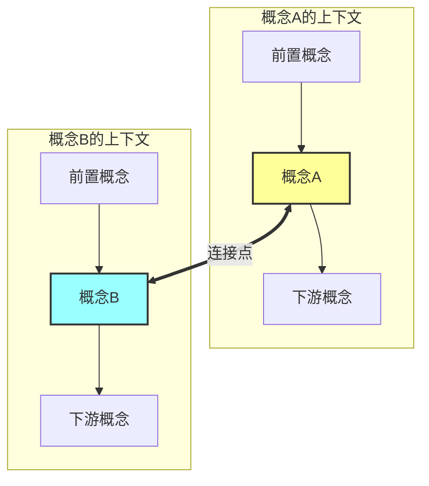
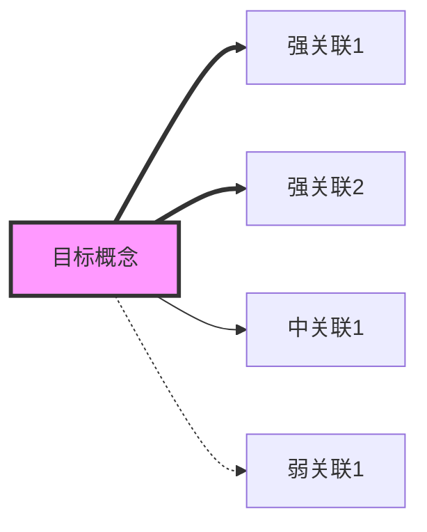

# learn-connect — 跨域关联分析

## 触发

用户输入 `/learn-connect <概念A> <概念B>` 或 `/learn-connect <概念>`（分析该概念与所有其他概念的关联）

## 工作流

### 单概念模式

1. 在 knowledge-map.yaml 中找到该概念
2. 读取该概念的知识笔记和相关洞察
3. 扫描所有其他概念，找出潜在关联
4. 按关联强度排序输出

### 双概念模式

1. 找到两个概念及其 vault 内容
2. 分析它们之间的关联：
   - **直接关联**：一个概念是另一个的输入/输出
   - **方法论关联**：共享类似的技术方法
   - **对立关联**：提供不同的解决思路
   - **互补关联**：组合使用效果更好
   - **历史关联**：一个概念的发展影响了另一个
3. 如果需要，用 WebSearch 搜索它们共同出现的论文或讨论
4. 输出分析报告

## 输出格式

```
🔗 概念关联分析: [A] ↔ [B]

## 关联网络图

（生成 Mermaid 图，展示两个概念及其周围的关联网络）

## 关联类型: [直接/方法论/对立/互补/历史]

## 连接点
1. ...
2. ...

## 深度分析
（详细解释这些连接为什么重要）

## 相关论文/资料
（提到这两个概念之间关系的论文或博客）

## 对知识体系的启示
（这个关联对理解整个领域有什么帮助）

## 建议的 wiki-link 更新
（如果两个概念的知识笔记应该互相链接，列出建议）
```

## Mermaid 图生成规范

### 双概念关联图

展示两个概念为中心节点，周围扩展关联概念：



### 单概念关联星图

以目标概念为中心，按关联强度辐射展开：



节点颜色约定：
- 🟡 `fill:#ff9` — 概念 A
- 🔵 `fill:#9ff` — 概念 B
- 🟣 `fill:#f9f` — 中心概念
- 默认 — 关联概念
