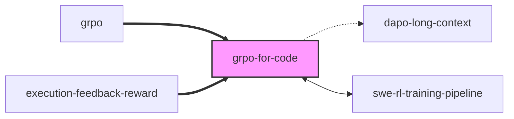

# learn-note — 创建知识笔记

## 触发

用户输入 `/learn-note <概念路径或关键词>`

## 工作流

### Step 1: 定位概念

1. 在 `~/.local/share/start-my-day/auto-learning/knowledge-map.yaml` 中查找概念
2. 确定对应的 vault 路径：`$VAULT_PATH/{vault_section}/{concept-id}.md`
3. 检查笔记是否已存在

### Step 2: 收集素材

1. 回顾当前对话中的学习内容（如果刚做完 learn-study）
2. 读取 `$VAULT_PATH/30_Insights/` 相关洞察
3. 读取 `$VAULT_PATH/20_Papers/` 相关论文笔记
4. 如果素材不足，使用 WebSearch + WebFetch 补充

### Step 3: 写入笔记

使用 `modules/auto-learning/lib/templates/knowledge-note.md` 模板，创建/更新笔记：

```yaml
---
title: "概念中文名"
type: knowledge
domain: "domain/subtopic"
concept_path: "domain/subtopic/concept"
depth: L?  # 当前评估的深度
created: YYYY-MM-DD
updated: YYYY-MM-DD
tags: [相关标签]
sources:
  - type: paper|blog|insight|docs
    title: "来源标题"
    url: "URL（如有）"
    path: "vault 路径（如有）"
prerequisites:
  - "[[前置概念]]"
---
```

### Step 4: 生成 Mermaid 图表

为笔记生成 2 种图表：

**架构/流程图**（"架构/流程图" 部分）：
- 根据概念类型选择图表类型：
  - 训练 pipeline → `graph TD`（上下流程）
  - 系统架构 → `graph LR`（左右架构）
  - 决策流程 → `flowchart TD`（含菱形判断）
  - 交互协议 → `sequenceDiagram`（时序图）
  - 方法分类 → `graph TD` 或 `mindmap`
- 用中文标注节点，英文缩写保留
- 关键路径用粗线 `==>` 或颜色 `style` 标注
- 如果概念不适合图表表达（纯理论/定义类），可删除此部分

**概念关系图**（"概念关系图" 部分）：
- 以本概念为中心，展示与其他概念的关系
- 关系类型用不同箭头：`-->` 依赖、`-.->` 弱关联、`<-->` 互补
- 节点使用 `[[wiki-link]]` 中的概念 id

示例：


### Step 5: 添加 Wiki-Links

- 在笔记正文中，对所有引用的其他概念使用 `[[concept-id]]` 格式
- 在 "与其他概念的关联" 部分，列出所有相关概念的双向链接
- 确保链接指向 knowledge-vault 内的其他笔记（使用概念 id 作为文件名）
- Mermaid 图中的节点 id 应与 wiki-link 的概念 id 一致

### Step 6: 处理外部图片（可选）

如果需要引用论文中的架构图或示意图：
1. 使用 WebFetch 下载图片，保存到 `$VAULT_PATH/assets/` 目录
2. 在笔记中用 `![[assets/image-name.png]]` 引用
3. 或直接使用外部 URL：``

优先使用 Mermaid 图表（可版本控制、可编辑），只有 Mermaid 无法表达的复杂图才用外部图片。

### Step 7: 更新状态

1. 更新 `~/.local/share/start-my-day/auto-learning/knowledge-map.yaml` 中该概念的 `vault_notes` 字段
2. 确认笔记路径已添加

## 写作规范

- 全部使用**中文**撰写，技术术语保留英文
- 每个部分控制在适当长度，避免冗长
- "我的理解与观点" 部分写用户个人的思考，不是通用知识
- sources 必须完整标注，包括 URL
- 使用 Obsidian 兼容的 markdown 语法

## 笔记质量检查

写入前确认：
- [ ] frontmatter 完整且格式正确
- [ ] sources 至少有 1 个来源
- [ ] 至少有 2 个 `[[wiki-link]]` 连接其他概念
- [ ] "定义" 部分简洁清晰
- [ ] "核心机制" 有技术深度
- [ ] Mermaid 图表语法正确（无孤立节点、箭头闭合）
- [ ] 概念关系图与 "与其他概念的关联" 文字描述一致
- [ ] 没有遗留的模板占位符
