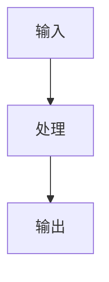
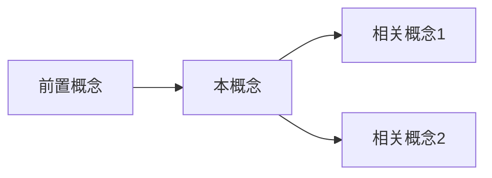

## 定义

（一句话定义这个概念是什么）

## 核心机制

（这个概念如何工作，关键的技术细节）

## 架构/流程图

> 用 Mermaid 绘制该概念的架构、流程、数据流或决策逻辑。根据概念类型选择合适的图表类型（graph/flowchart/sequence/classDiagram）。如果该概念不适合用图表表达则删除此部分。

## 方法对比

| 方法 | 优势 | 劣势 | 适用场景 |
|------|------|------|----------|
| | | | |

## 关键发现

（来自论文/博客的关键实验发现和数字）

## 概念关系图

## 与其他概念的关联

- 与 [[]] 的关系：...

## 开放问题

（这个概念中尚未解决的问题）

## 我的理解与观点

（个人的理解、批判、延伸思考）
